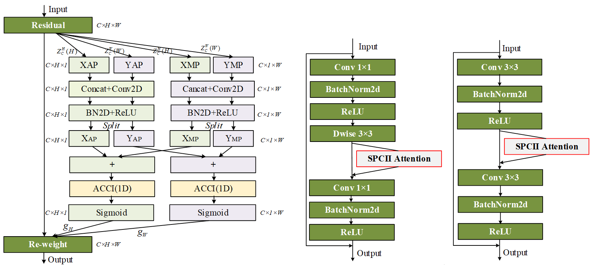

# SPCII Attention

Our coordinate attention can be easily plugged into any classic building blocks as a feature representation augmentation tool. Here ([pytorch-image-models](https://github.com/yifanna/SPCII/model)) is a code base that you might want to train a classification model on cifar-10, cifar-100, stl-10.

Note that the results reported in the paper are based on regular training setting (200 training epochs, random crop, and cosine learning schedule) **without** using extra label smoothing, random augmentation, random erasing, mixup. 

### Updates

- [Pretrained model](https://github.com/yifanna/SPCII/model_weights_spcii-cifar200.pth) (MobileNetV2 with SPCII) and [model file](/mbv2_SPCII.py) are both available.

### Note: The data reported in the manuscript are average results from 10 runs under the same environment. The .pth file given here is the best value among the results of 10 runs in the same environment.
---
### Train

python model.py

### verification

python val.py

### SPCII

(a) SPCII      (b) MobileNetV2 + SPCII attention      (C) ResNet + SPCII attention

